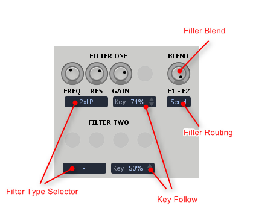
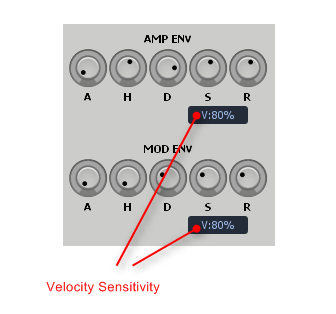
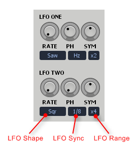
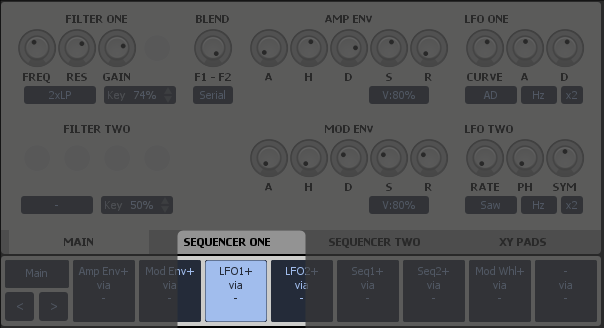
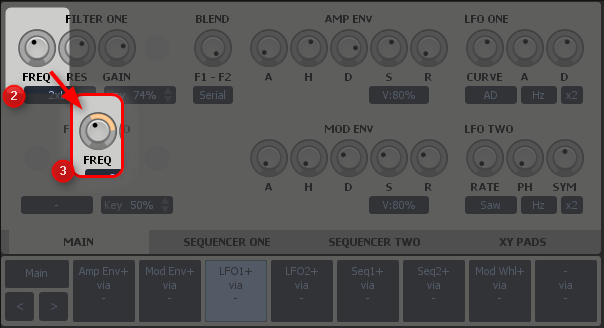
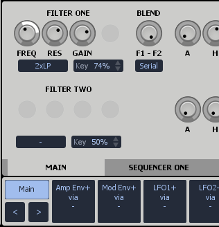

# Lucidity Manual #

* Last Updated 19th July 2014
* For Lucidity Version 0.x.x.x

## Credits ##

Thanks to the BETA Testers

Steinberg credit etc.

# Welcome to Lucidity #

Lucidity is a VST Plugin Sampler. It's been designed for use with MIDI keyboards. As such it's ideal for playing back "melodic" samples. Pianos, keys, strings, synths etc. Some additions have been included for playback of loops to increase Lucidity versatility.

Talk about where lucidity comes from, the eventual goal.   

sample playback instrument that follows in the footsteps of many other 

Development of Lucidity began at the end of 2012. I wanted to create a sampler 

Thank you for purchasing Lucidity. Your support enables ongoing development of Lucidity and other software. I hope you enjoy using Lucidity!

Yours Sincerely,  
Shannon Oram  
One Small Clue   
shannon@onesmallclue.com  

# Installation and Setup #

# Interface Elements #

## File Browser ##

The file browser is a convenient way to load samples and Lucidity Programs. All items in the browser are mapped to directories (or folders) on your hard-drive.

Add and Remove items from the file browser via context menu. (Right click anywhere in the browser.)  

## Sample Display ##

The sample display shows the currently selected sample. 

The sample markers (sample start, sample end, loop start, loop end) can all be adjusted by dragging. 

There are a number of sample playback controls under the sample display.

**Volume:** Adjust volume of sample. 
**Pan:** Adjust stereo balance of sample.  
**Tune:** Adjust pitch of sample in semitone steps. 
**Fine:** Adjust pitch of sample by +/- 100 cents. 
  
## Voice Controls ##

The voice controls are split over two panels. The voice controls adjust sample playback. All voice control settings are applied to all samples in the *key group*.

### Main Voice Controls ###

**Gain:** Adjust volume of key group. 
**Pan:** Adjust stereo balance of key group.  
**Tune:** Adjust pitch of key group in semitone steps. 
**Fine:** Adjust pitch of key group by +/- 100 cents. 

**Track:** controls how and when a sample is re-pitched. 

* **NOTE:** Use for keyboard type sounds.
* **BPM:** Use for tempo synced loops.
* **OFF:** No pitch tracking. Sample always plays back at the same pitch.

**Trigger:** Turns looping on or off.

* **NOTE ON:** No looping. Sample plays until MIDI Note Off event is received.
* **ONE SHOT:** No looping. Sample plays until end.
* **LOOP CONTINUOUS:** Looping on.
* **LOOP UNTIL RELEASE:** Looping on until a MIDI Note Off event is received.

**Bounds:** Controls where the sample loops.

* **SAMPLE:** Loops between sample start and sample end markers.
* **LOOP:** Loops between loop start and loop end markers.

Looping using **SAMPLE** bounds is useful when modulating the sample start and end markers to produce "glitchy" sounds.

**Reset:** When set to **LFO 1** or **LFO 2**, the sample playback position will be reset to the beginning in sync with the LFO source. This is useful for doing tempo synced drum roll type sounds. 

**Mode:** The voice mode selector.

* **POLY:** Normal polyphonic mode.
* **MONO:** Monophonic, each note re-triggers envelopes and LFOs. 
* **LEGATO:** Monophonic, envelopes aren't re-triggered when notes overlap.  
* **LATCH:** The first note triggers a voice. The second note releases or stops the voice. LATCH is normally used with loops. 

**Glide:** Controls the pitch slew rate when using MONO or LEGATO voice modes. 

### The Filter Section ###

Lucidity features two flexible filter slots. Each filter slot can load one of several different filter types. The two filters can be routed in a serial or parallel configuration. 

**Filter Type Selector:** Choose the type of filter.

**Filter Key Follow:** Controls how much the filter frequency will track the MIDI Input.  

**Filter Blend:** When the knob is fully CCW only FILTER ONE will heard at the output. When the knob is fully CW only FILTER TWO will be heard at the output. In between values allow for the two filters to be mixed together.  

**Filter Routing:**

* **SERIAL:** The output of FILTER ONE will be fed to the input of FILTER TWO. FILTER TWO is sent to the output. 
* **PARALLEL:** The output of both filters is sent directly to the output. 

BLEND will control the balance of the two filters in both FILTER ROUTING modes. Ensure the BLEND knob is fully CW for the classic serial mode filter routing. Other values will allow some of filter one to be heard in the output.  
 

### The AHDSR Envelope Section ###
 
Lucidity has two clasic AHDSR envelopes. The **AMP ENVELOPE** is always routed to the voice amplitude (volume). The **MOD ENVELOPE** is freely assignable to any destination via the modulation matrix.  

**A:** Attack envelope time.  
**H:** Hold envelope time. 
**D:** Decay envelope time. 
**S:** Sustain envelope time. 
**R:** Release envelope time. 

**Velocity Sensitivity:** Controls how much the MIDI velocity input level affects the amplitude of the envelope.  At 0% the envelope will always rise to the full envelope value. At 100% the envelope will be scaled by the velocity value. Lower velocity values will trigger correspondingly smaller envelope signals.   

### The LFO Section ###

Lucidity has two Low Frequency Oscillators (LFO) with the usual selection of triangle, square and ramp wave shapes. There are some more exotic selections as well. 

  
**LFO Shape:** Selects the LFO waveform shape. The function of the three LFO knobs will vary depending on the LFO shape.

**LFO Sync:** Select between a free-running and tempo-synced LFO. 

**LFO Range:** Select the Maximum LFO time.

#### Periodic LFO Waveform Shapes ####

* Saw 
* Ramp
* Triangle
* Square 
* Sine

The three LFO knobs are **RATE**, **PH** (phase) and **SYM** (symmetry) when using the periodic waveform shapes.

 
#### Random LFO Waveform Shapes ####

* Random Smooth 
* Random Stepped

The three LFO knobs are **RATE**, **%** (chance of change) and **FLUX** (amount of change).

  
#### Attack-Decay LFO Waveform Shapes ####

* Attack-Decay
* Attack-Release
* Cycle

The three LFO knobs are **CURVE**, **A** (attack) and **D** (decay) or **R** (release).

These selections are not regular LFO shapes in the traditional sense. They are based on Attack-Decay envelopes commonly found in modular synthesisers.

Each selection has a Attack stage where the signal rises from 0 to 100%, then a Decay or Release stage when the signal falls back to 0%. The time of each stage is controlled independently instead of using a single Rate control as with the other LFO waveform shapes.    

**Attack-Decay** and **Attack-Release** is triggered at the beginning of a note and will not cycle or repeat. They are not LFO's in the strict sense.

**Cycle** is also triggered at the beginning of a note. Unlike the other two, **Cycle** will repeat continuously. In this way it produces similar results to the **Triangle** LFO waveform shape. 

### The Sequencer Section ###

Lucidity also features two step sequencers for maximum modulation possibilities!

**Clock:** Controls the speed of the sequencer.  
**Mode:** Controls the direction of the sequencer.   
**Steps:** Sets the number of steps in a sequence.  

A sequencer context menu has commands to RESET or RANDOMISE the steps.

### The XY Pads ###

The XY Pads provide another modulation source similar to the Mod Envelope or the LFOs. The XY Pads can modulate multiple parameters at once using the Modulation Matrix.

Most commonly the XY Pads will be linked to your MIDI controller knobs. They provide an important interface point between your MIDI controller and Lucidity's parameters.

Right click an XY Pad to show the context menu with commands for MIDI Learn etc.       

## Filters ##

(Details about the individual filter types goes here!)   

## Modulation ##

The Modulation Matrix routes signals from the modulation sources (LFOs, Envelopes, XY Pads, MIDI Input etc) to Lucidity's parameters. It is the heart of Lucidity's modulation system.   

**Main:** Modulation Matrix editing is disabled when the MAIN button is selected (as shown in the image above).

**Mod Shots:** Lucidity features 8 MOD SLOTS. Each MOD SLOT provides a way to route one modulation source to multiple destinations. 

**Prev/Next Mod Slot:** These buttons select the previous or next MOD SLOT. Off course you don't have to use these buttons. You may simply click on the desired MOD SLOT to select it.

### How To Internally Modulate a Parameter ###

**Step 1** Select a MOD SLOT

**Step 2** Locate the parameter you would like to modulate. Filter One FREQ in this case.

**Step 3** Hold the ALT key while using the adjust the knob. You will see the modulation depth indicator advance around the knob.  

**Step 4** Select the MAIN modulation button. Notice the modulation depth indicator around the FREQ knob changes color. It now shows the maximum modulation depth of all modulation sources combined. (A parameter can be modulated by multiple modulation sources.)

# The Mapping Editor #

Samples, which are audio files, are made playable by creating Regions. Regions are mapped to a location on a keyboard. Each region contains 1 sample.  

One or more sample files may be dropped on the mapping display to add more sample regions. Audio samples can dragged from Lucidity's browser, Windows' file explore or from within some hosts. (Reaper, Cubase and many others support audio being dragged directly from the project timeline to VST Plugins.)

# Keyboard Shortcuts #

Hotkey support is fairly limited at this time and will slowly improve in future updates. 

**Up/Down/Left/Right:** Navigate the browser. 
**Enter:** Load selected item in browser.  
 

    

 

